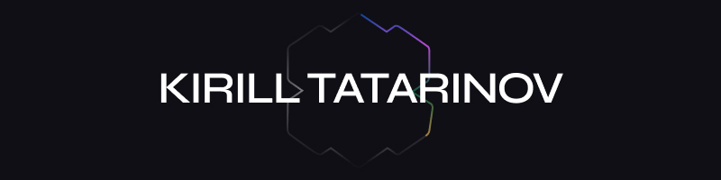
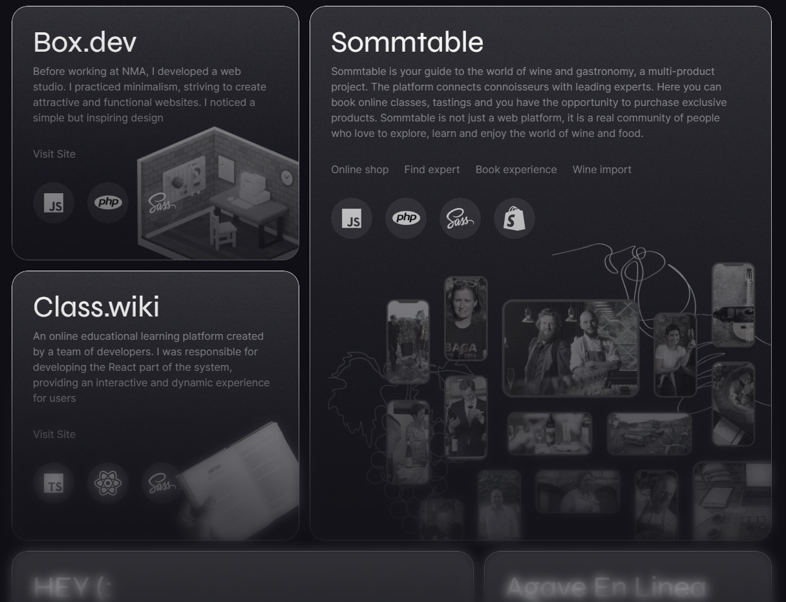
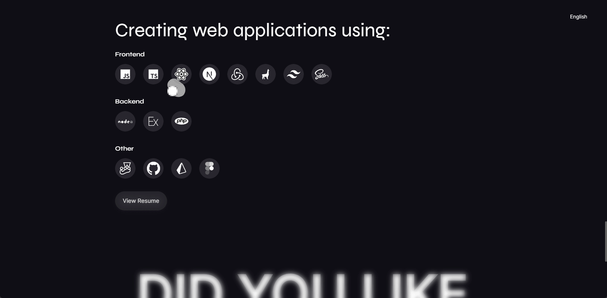

# Kirill Tatarinov - Portfolio



## Introduction

Welcome to my portfolio repository! This repository showcases my personal portfolio website built using TypeScript, Next.js, TailwindCSS, Blobity, Framer Motion, next-translate, redux, and Spline.

As a passionate Frontend Developer, I'm dedicated to creating user-friendly and visually appealing web applications. This portfolio serves as a demonstration of my skills, experience, and the technologies I'm proficient in.

## Technologies Used

- [TypeScript](https://www.typescriptlang.org/)
- [Next.js](https://nextjs.org/)
- [TailwindCSS](https://tailwindcss.com/)
- [Blobity](https://blobity.dev/)
- [Framer Motion](https://www.framer.com/motion/)
- [next-translate](https://github.com/vinissimus/next-translate)
- [Redux](https://redux.js.org/)
- [Spline](https://spline.design/)

## About Me

My name is Kirill Tatarinov, and I am a Frontend Developer with a strong passion for creating intuitive and interactive user experiences. Here's a brief overview of my professional journey:

- **2020-2021:** Worked as a Web Developer at [Studiobox.dev](https://studiobox.dev/), contributing to various web projects and gaining valuable experience in the industry.
- **2021-2023:** Served as a Frontend Developer at [NMA](https://newmedia.agency/), where I honed my skills in building responsive and performant user interfaces.

I was born on October 30, 2001. Living in Moscow, Russia. You can contact me via email at [boxdeveloper@studiobox.dev](mailto:boxdeveloper@studiobox.dev).

## Portfolio Preview






## How to Use This Portfolio

1. Clone this repository using the following command:

   ```bash
   git clone https://github.com/molodoychelovek0123/portfolio-2023.git
   ```
2. Navigate to the project directory:

   ```bash
   cd portfolio-2023
   ```

3. Install the required dependencies:
   
   ```bash 
    yarn install
   ```

4. Start the development server:
   ```bash 
   yarn dev
   ```
   
5. Open your browser and visit http://localhost:3000 to view the portfolio.

Feel free to explore the code, make improvements, and customize the portfolio to make it your own!

---

Thank you for visiting my portfolio. If you have any questions or would like to chat, please do contact me.